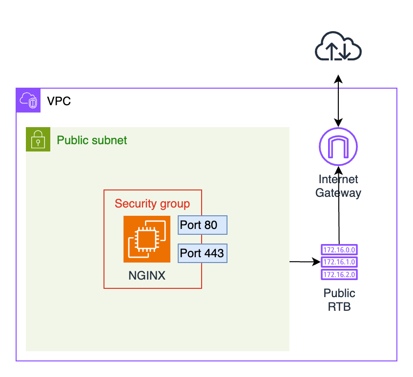

# Deploying an EC2 instance for NGINX Server in AWS

In this mini project:
- We will be deploying an NGINX server in AWS. 
- We will create a new VPC
- Set up public and private subnets, and:
- Deploy an EC2 instance using the Ubuntu AMI. Later, we will replace the instance with an NGINX Bitnami AMI and associate it with a security group. 
- Finally, we will test the website accessibility and tag the resources with project information.

## Project Structure

## Required steps

1. Deploy a new VPC in AWS in the region of your choice. [done]
2. Within the VPC, deploy a public subnet. [done]
3. Deploy an internet gateway and associate it with the VPC. [done]
4. Setup a secondary route table with a route to the IGW and explicitly associate it with the public subnet. [done]
5. Deploy an EC2 instance in the public subnet using the Ubuntu AMI. [done]
6. Create a security group that allows traffic only on ports 80 (HTTP) and 443 (HTTPS) and associate a Public IP address. [done]
7. Change the previous instance by deploying another EC2 instance using the NGINX Bitnami AMI (Free Tier). [done]
8. Confirm that it's possible to access the website via its public IP. [done]
9. Destroy all resources with $terraform destroy --auto-approve after the test completed! [done]